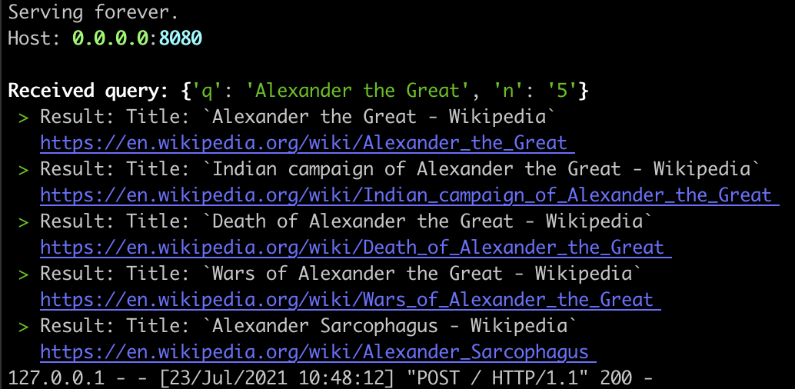

A web search server for ParlAI, including Blenderbot2.


*Querying the server:*


*The server reacting correctly:*



- Uses `html2text` to strip the markup out of the page.
- Uses `beautifulsoup4` to parse the title.
- Currently only uses the `googlesearch` module to query Google for urls, but is coded
in a modular / search engine agnostic way to allow very easily add new search engine support.


Using the `googlesearch` module is very slow because it parses webpages instead of querying webservices. This is fine for playing with the model, but makes that searcher unusable for training or large scale inference purposes.


To be able to train, one would just have to for example pay for Google Cloud or Microsoft Azure's search services, and derive the Search class to query them.

### Quick Start:

First install the requirements:
```bash
pip install -r requirements.txt
```

Run this command in one terminal tab:
```bash
python search_server.py serve --host 0.0.0.0:8080
```

[Optional] You can then test the server with 
```
curl -X POST "http://0.0.0.0:8080" -d "q=baseball&n=1"
```

Then for example start Blenderbot2 in a different terminal tab:
```
python -m parlai interactive --model-file zoo:blenderbot2/blenderbot2_3B/model --search_server 0.0.0.0:8080
```

### Colab
There is a jupyter notebook. Just run it. However it only works in instances with large memories. 

### Testing the server:
You need to already be running a server by calling serve on the same hostname and ip. 
This will create a parlai.agents.rag.retrieve_api.SearchEngineRetriever and try to connect 
and send a query, and parse the answer.

```bash
python search_server.py test_server --host 0.0.0.0:8080
```

### Testing the parser:

```bash
python search_server.py test_parser www.some_url_of_your_choice.com/
```
